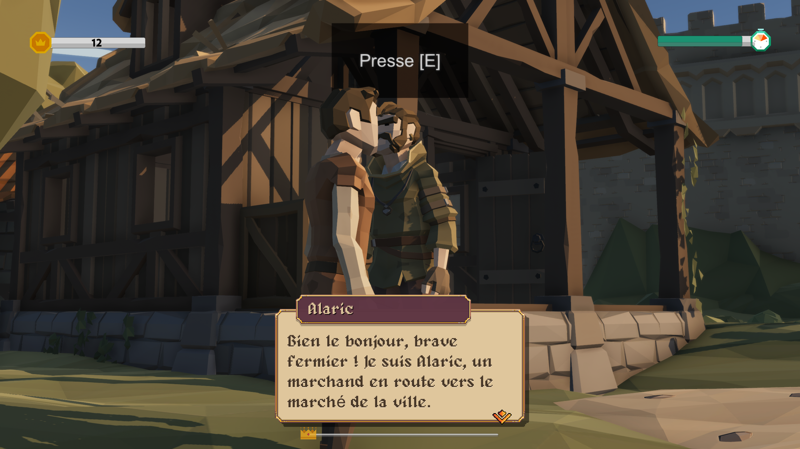
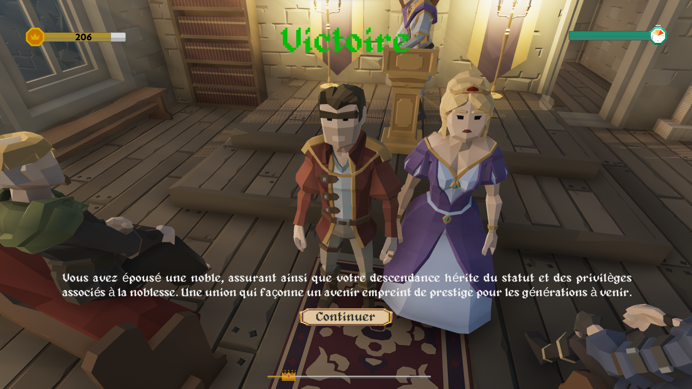
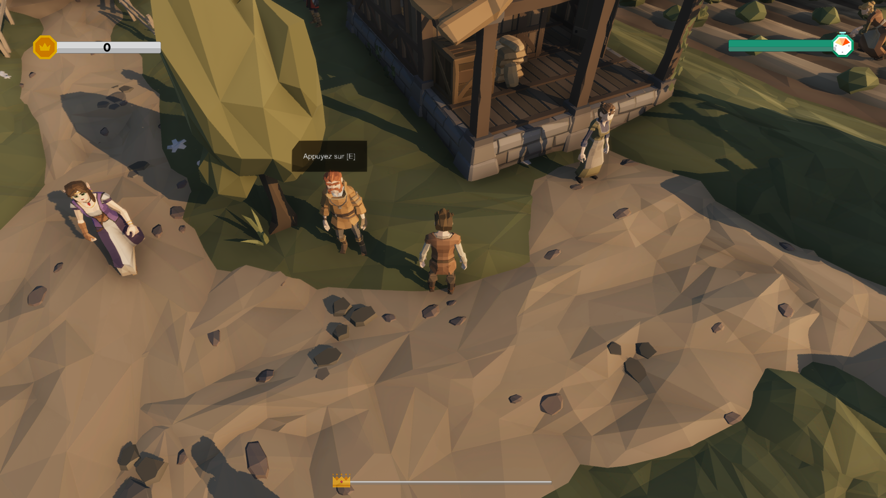
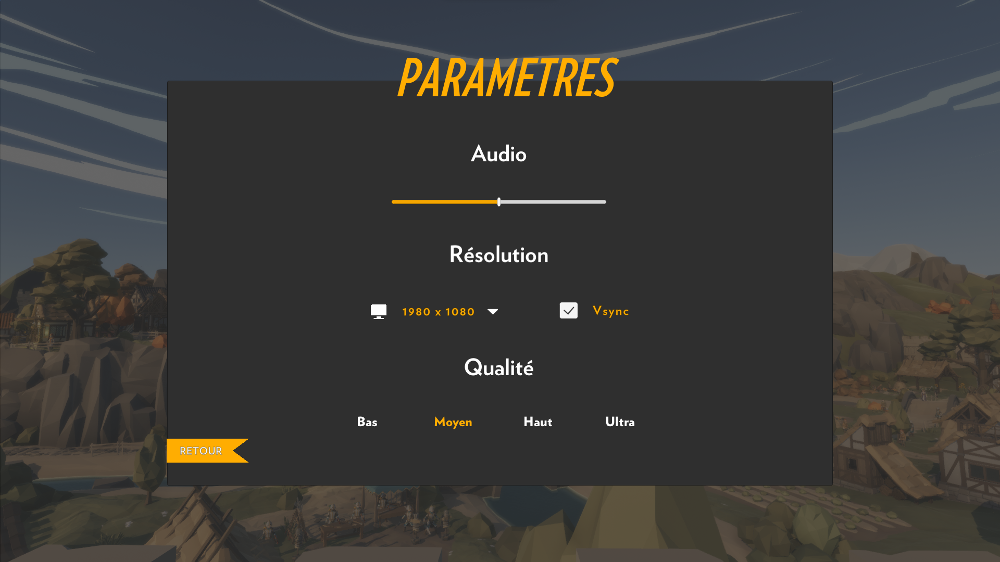

# T3 - MOD23-D

## Table des matières
- [Contributeurs](#contributeurs)
- [Description](#description)
- [Installation](#installation)
- [Sous la direction de](#sous-la-direction-de)
- [Captures d'écran](#captures-décran)
- [Statut du projet](#statut-du-projet)
- [Langages](#langages)
- [Outils](#outils)
- [Systèmes d'exploitation](#systèmes-dexploitation)
- [Moteurs de jeu](#moteurs-de-jeu)
- [License](#license)

## Contributeurs
- [__Arnaud Michel__](https://github.com/MrArnaudMichel) (Développeur, Coordinateur GIT, Game Designer, Scénariste)
- [__Léo Kiefner__](https://github.com/LeoKiefner) (Développeur, Game Designer, Mappeur, Scénariste)
- [__Benjamin Morawiec__](https://github.com/bjt2017) (Développeur, Game Designer, Scénariste, Graphiste)

## Description
Nooblety est un jeu immersif qui vous transporte dans un univers médiéval se déroulant à Amboise pendant la Renaissance jusqu'au début des Guerres de religion (1450 - 1574). Vous commencerez en incarnant un jeune paysan, mais votre objectif est de gravir les échelons de la société pour devenir un noble respecté.

Votre personnage naît dans la peau d'un modeste paysan, et vous avez la liberté de choisir comment il évolue. Vous pouvez tenter de maximiser vos profits en vendant vos produits, ou bien essayer (même si cela peut s'avérer difficile) de bâtir un réseau de relations et une réputation parmi les différentes castes sociales.

Une fois votre heure arrivée, le fils de votre personnage naît, vous prendrez le contrôle de sa destinée. Vous pourrez choisir son métier en fonction des ressources et de la réputation que vous avez accumulées avec le personnage précédent. Votre nouveau personnage, un fils né avec des opportunités différentes, pourra entreprendre diverses quêtes visant à obtenir la reconnaissance de la noblesse.

Le jeu se poursuit jusqu'à ce que votre personnage atteigne le statut de noble tant convoité ou jusqu'à la fin d'un nombre prédéfini de générations. Serez-vous capable de guider votre lignée vers la noblesse et la gloire dans cet univers médiéval exigeant ?

## Guide

Vous pouvez accéder au site internet de **Nooblety** sur ce __[lien](https://nooblety.arnaudmichel.fr/)__. 

## Installation
#### Installer le Jeu

> [!IMPORTANT]
> __Remarque :__ Le jeu est disponible sur Windows, Linux et MacOS.
> L'antivirus Windows Defender peut bloquer l'installation du jeu. Si c'est le cas, cliquez sur "Plus d'infos" puis sur "Exécuter quand même".
> Si vous avez un message d'erreur lors de l'installation, vérifiez que vous avez assez d'espace disque disponible.
> Si vous rencontrez des problèmes lors de l'installation, faite une [issue]([https://git.unistra.fr/t3-michel-morawien-kiefner/mod23-d](https://github.com/MrArnaudMichel/T3/issues))

###### Windows
- Aller dans le dossier Game puis dans le dossier Windows
- Télécharger le fichier Nooblety-Setup.exe
- Exécuter le fichier Nooblety-Setup.exe
- Suivre les instructions de l'installateur
- Lancer le jeu via le raccourci sur le bureau

###### Linux
- Aller dans le dossier Game
- Télécharger le dossier Linux
- Extraire le dossier Linux
- Lancer le fichier Nooblety.x86_64

###### MacOS
- Aller dans le dossier Game
- Télécharger le dossier MacOS
- Extraire le dossier MacOS
- Lancer le fichier Nooblety.app

#### Désinstaller le jeu
- Aller dans le dossier d'installation du jeu
- lancez le fichier Uninstall.exe

## Sous la direction de
- [M. Julien GOSSA](https://twitter.com/JulienGossa) (Support)
- [M. Eric Wessler-Laux](https://twitter.com/jclebreton) (Poster)

## Captures d'écran

## Statut du projet
- [x] Terminé

## Langages
- C#
- PlantUML

## Outils
- Unity Dashboard
- Visual Studio
- Git
- Plastic SCM

## Systèmes d'exploitation
- Windows
- Linux
- MacOS

## Moteurs de jeu
- Unity 2022.3.4f1

## License

Ce projet est sous licence MIT - voir le fichier [LICENSE.md](LICENSE.md) pour plus d'informations.
